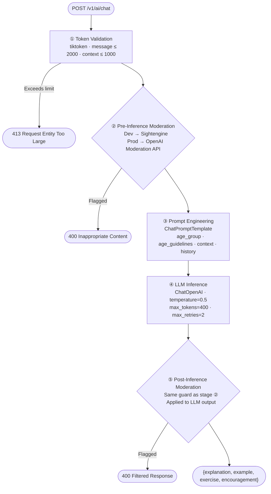

# KidsMind AI Service

A production-ready FastAPI microservice powering the KidsMind educational assistant. Designed around a **safety-first inference pipeline**, every request is moderated before and after LLM inference to ensure all content delivered to children aged 3–15 is appropriate, accurate, and encouraging.

## Table of Contents

- [KidsMind AI Service](#kidsmind-ai-service)
  - [Table of Contents](#table-of-contents)
  - [Mission](#mission)
  - [Features](#features)
  - [Safety-First Pipeline](#safety-first-pipeline)
    - [Stage Details](#stage-details)
  - [Prompt Engineering](#prompt-engineering)
    - [System Prompt](#system-prompt)
    - [Prompt Template Structure](#prompt-template-structure)
    - [Age-Adaptive Guidelines](#age-adaptive-guidelines)
  - [Moderation](#moderation)
    - [Production — OpenAI Moderation API](#production--openai-moderation-api)
    - [Development — Sightengine API](#development--sightengine-api)
  - [API](#api)
    - [`POST /v1/ai/chat`](#post-v1aichat)
    - [`GET /`](#get-)
    - [`GET /metrics`](#get-metrics)
  - [Configuration](#configuration)
  - [Dependencies](#dependencies)
  - [Repository Structure](#repository-structure)
  - [Docker](#docker)
    - [Quick Start](#quick-start)
    - [Multi-Stage Build](#multi-stage-build)
  - [Security](#security)
    - [Non-Root Execution](#non-root-execution)
    - [Fail-Closed Moderation](#fail-closed-moderation)
  - [Observability](#observability)

---

## Mission

KidsMind is not a general-purpose chatbot. It is a persona-locked educational assistant with a single objective: help children learn. The system prompt, moderation thresholds, age-adaptive guidelines, and structured output contract are all designed to enforce this mission at every layer of the stack.

---

## Features

- **Safety-First Pipeline** — dual moderation gates (pre- and post-inference) prevent inappropriate content from entering or leaving the system
- **Environment-aware moderation** — Sightengine (dev) and OpenAI Moderation API (production) with separate, tuned threshold sets
- **Age-adaptive responses** — dynamic guidelines for three age brackets (3–6, 7–11, 12–15) adjust vocabulary, tone, and exercise complexity automatically
- **Structured LLM output** — the model is contractually bound via the system prompt to return a four-field JSON object on every turn
- **Token overflow protection** — `tiktoken` validates both message (≤ 2,000 tokens) and context (≤ 1,000 tokens) before any downstream call is made
- **Prometheus instrumentation** — all routes are auto-instrumented and metrics are exposed at `/metrics`
- **Non-root container** — the runtime image executes as `appuser` with no write access outside `/app`
- **OpenAI-compatible LLM backend** — configurable `BASE_URL` supports any OpenAI-compatible inference endpoint

---

## Safety-First Pipeline

Every request travels through five sequential stages. No stage is skippable.



### Stage Details

| # | Stage | Implementation | Failure Behaviour |
|---|---|---|---|
| ① | Token Validation | `tiktoken` — model-specific encoding, `cl100k_base` fallback | `HTTP 413` |
| ② | Pre-Inference Moderation | Sightengine (dev) / OpenAI Moderation API (prod) | `HTTP 400` |
| ③ | Prompt Engineering | `ChatPromptTemplate` + `MessagesPlaceholder` | — |
| ④ | LLM Inference | `ChatOpenAI` via LangChain pipe `prompt \| llm` | `HTTP 500` |
| ⑤ | Post-Inference Moderation | Same guard as stage ② applied to `response.content` | `HTTP 400` |

---

## Prompt Engineering

### System Prompt

The `BASE_SYSTEM_PROMPT` is the behavioral contract of the KidsMind persona. It is injected as the first message in every `ChatPromptTemplate` and cannot be overridden by user input.

```python
BASE_SYSTEM_PROMPT = """
You are KidsMind, a friendly, patient educational assistant for kids aged 3-15.

Mission:
- Help children learn.
- Always explain clearly.
- Give examples.
- Give small exercises.
- Encourage positively.
- Refuse inappropriate content.

Adapt response style to AGE GROUP:
Use the kid age group ({age_group}) and {age_guidelines} to adapt tone, vocabulary, and examples.

Use the provided CONTEXT to understand the child's current knowledge and interests : {context}.

Keep responses concise and Always respond in JSON format:
{
  "explanation": "...",
  "example": "...",
  "exercise": "...",
  "encouragement": "..."
}
"""
```

The template variables `{age_group}`, `{age_guidelines}`, and `{context}` are resolved at request time from the incoming payload and the `age_guidelines()` utility.

### Prompt Template Structure

```
[system]   BASE_SYSTEM_PROMPT (persona + JSON contract)
[history]  MessagesPlaceholder (conversation turns — future implementation)
[human]    {input} (current user message)
```

### Age-Adaptive Guidelines

The `age_guidelines()` utility resolves `{age_guidelines}` based on the `age_group` field:

| Age Group | Behavioural Directive |
|---|---|
| `3-6` | Very short sentences, simple vocabulary, emojis, mini-game framing |
| `7-11` | Clear explanations, brief exercises, encouraging and interactive tone |
| `12-15` | Step-by-step reasoning, deeper explanations, thought-provoking exercises |
| Default | General educational tone, adaptive to user feedback |

---

## Moderation

Two independent moderation implementations are selected at runtime based on `IS_PROD`.

### Production — OpenAI Moderation API

Applied at both pre- and post-inference. Uses custom per-category score thresholds that are **stricter than OpenAI's defaults** to match a child-safe context.

| Category | Threshold |
|---|---|
| `violence` | `0.4` |
| `hate` | `0.3` |
| `harassment` | `0.5` |
| `sexual` | `0.2` |
| `self-harm` | `0.5` |

Content fails if `results["flagged"]` is `true` **or** if any category score exceeds its threshold — whichever is stricter.

### Development — Sightengine API

Free-tier Sightengine endpoint used during development to avoid OpenAI API costs. Uses the `general,self-harm` ML models with its own threshold set:

| Category | Threshold |
|---|---|
| `violent` | `0.5` |
| `insulting` | `0.4` |
| `discriminatory` | `0.4` |
| `toxic` | `0.5` |
| `sexual` | `0.25` |
| `self-harm` | `0.4` |

Both implementations return `True` (safe) or `False` (blocked) and raise `HTTPException` on API failure — guaranteeing fail-closed behaviour.

---

## API

### `POST /v1/ai/chat`

The primary inference endpoint.

**Request body** (`application/json`):

```json
{
  "message": "What is photosynthesis?",
  "context": "The child is studying plants in school.",
  "age_group": "7-11"
}
```

| Field | Type | Required | Constraints | Description |
|---|---|---|---|---|
| `message` | `string` | Yes | `max_length=10000`, `≤ 2000 tokens` | The child's question or input |
| `context` | `string` | No | `max_length=1000`, `≤ 1000 tokens` | Context about the child's current learning state |
| `age_group` | `string` | No | `max_length=5`, default `"3-15"` | One of `"3-6"`, `"7-11"`, `"12-15"` |

**Response** (`200 OK`):

```json
{
  "response": "{\"explanation\": \"Plants use sunlight...\", \"example\": \"...\", \"exercise\": \"...\", \"encouragement\": \"...\"}",
  "processing_time": 2.14
}
```

| Field | Type | Description |
|---|---|---|
| `response` | `string` | LLM output — a serialized JSON string conforming to the four-field contract |
| `processing_time` | `float` | End-to-end server-side latency in seconds (includes both moderation calls) |

**Error responses:**

| Status | Condition |
|---|---|
| `400` | User message or LLM response failed moderation |
| `413` | `message` or `context` exceeds token limit |
| `500` | LLM invocation or unexpected internal error |

### `GET /`

Health check. Returns `{"status": "ok"}`. Used for liveness probing.

### `GET /metrics`

Prometheus-compatible metrics endpoint. Auto-instrumented per route with request count, latency histograms, and in-flight gauges.

---

## Configuration

All secrets and runtime settings are injected via environment variables. No values are hardcoded.

| Variable | Required | Description |
|---|---|---|
| `IS_PROD` | No (default: `False`) | Switches between Sightengine (dev) and OpenAI Moderation API (prod) |
| `MODEL_NAME` | Yes | LLM model identifier (e.g. `gpt-4o-mini`) |
| `BASE_URL` | Yes | OpenAI-compatible inference endpoint base URL |
| `API_KEY` | Yes | API key for the LLM backend |
| `GUARD_API_KEY` | Prod only | OpenAI API key for moderation |
| `GUARD_API_URL` | Prod only | OpenAI moderation endpoint URL |
| `GUARD_MODEL_NAME` | Prod only | Moderation model identifier |
| `DEV_GUARD_API_KEY` | Dev only | Sightengine `api_secret` |
| `DEV_GUARD_API_URL` | Dev only | Sightengine moderation endpoint URL |
| `DEV_API_USER` | Dev only | Sightengine `api_user` |
| `CONTENT_LENGTH_LIMIT` | No (default: `1MB`) | Max raw request body size in bytes |
| `RATE_LIMIT` | No (default: `100/minute` in dev) | Request rate limit per client |

---

## Dependencies

| Package | Version | Role |
|---|---|---|
| `fastapi` | `0.128.5` | API framework — routing, dependency injection, request validation, OpenAPI |
| `uvicorn` | `0.40.0` | ASGI server — async I/O event loop runner |
| `langchain` | `1.2.10` | Orchestration layer — chain composition and prompt pipeline |
| `langchain-openai` | `1.1.10` | `ChatOpenAI` integration — wraps the OpenAI-compatible LLM backend |
| `langchain-core` | `1.2.16` | Core abstractions — `ChatPromptTemplate`, `MessagesPlaceholder`, runnable protocol |
| `tiktoken` | `0.12.0` | Token counting — enforces input limits before moderation or inference |
| `prometheus-fastapi-instrumentator` | `7.1.0` | Auto-instruments FastAPI routes and exposes `/metrics` |
| `httpx` | `0.28.1` | Async HTTP client — used for all external moderation API calls |

---

## Repository Structure

```
ai-service/
├── app/
│   ├── core/
│   ├── schemas/              # Pydantic models for request/response validation
│   ├── controllers           # Request handlers
│   ├── routers/              # FastAPI route definitions
│   ├── services/             # Business logic
│   ├── utils/                # Helper functions
│   └── main.py               # FastAPI factory, lifespan, Prometheus instrumentation
├── .dockerignore
├── Dockerfile                # Multi-stage build, non-root user
├── requirements.txt
└── README.md
```

---

## Docker

### Quick Start

**Build:**

```bash
docker build -t kidsmind-ai:latest .
```

**Run (development):**

```bash
docker run --rm \
  -p 8000:8000 \
  -e IS_PROD=False \
  -e MODEL_NAME=gpt-4o-mini \
  -e BASE_URL=https://api.openai.com/v1 \
  -e API_KEY=sk-... \
  -e DEV_GUARD_API_KEY=<sightengine-secret> \
  -e DEV_GUARD_API_URL=https://api.sightengine.com/1.0/text/check.json \
  -e DEV_API_USER=<sightengine-user> \
  kidsmind-ai:latest
```

**Run (production):**

```bash
docker run --rm \
  -p 8000:8000 \
  -e IS_PROD=True \
  -e MODEL_NAME=gpt-4o \
  -e BASE_URL=https://api.openai.com/v1 \
  -e API_KEY=sk-... \
  -e GUARD_API_KEY=sk-... \
  -e GUARD_API_URL=https://api.openai.com/v1/moderations \
  -e GUARD_MODEL_NAME=omni-moderation-latest \
  -e RATE_LIMIT=30/minute \
  kidsmind-ai:latest
```

### Multi-Stage Build

| Stage | Base Image | Purpose |
|---|---|---|
| `builder` | `python:3.12-slim` | Installs gcc, creates virtualenv, installs all Python dependencies |
| `runtime` | `python:3.12-slim` | Copies only the virtualenv and app code — no build toolchain in the final image |

The runtime stage runs `python -m compileall -q .` to pre-compile all `.py` files to bytecode, eliminating first-request compilation overhead.

---

## Security

### Non-Root Execution

The container creates and runs as a dedicated `appuser` system account:

```dockerfile
RUN groupadd -r appuser && useradd -r -g appuser appuser
...
RUN chown -R appuser:appuser /app
USER appuser
```

If the process is compromised, the attacker has no write access beyond `/app` and no ability to escalate to root or affect the host via a container breakout.

### Fail-Closed Moderation

Both `check_moderation` and `dev_check_moderation` raise `HTTPException` on any API failure. There is no fallback that silently passes content — if the moderation API is unreachable, the request is rejected. This is intentional: it is safer to refuse a legitimate request than to allow an unmoderated response through to a child.

---

## Observability

Prometheus metrics are collected per route automatically:

```
http_requests_total{method, handler, status}
http_request_duration_seconds{method, handler}
http_requests_in_progress{method, handler}
```


