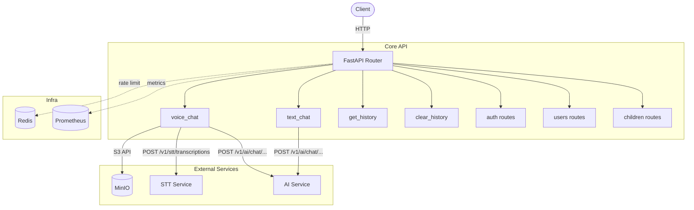
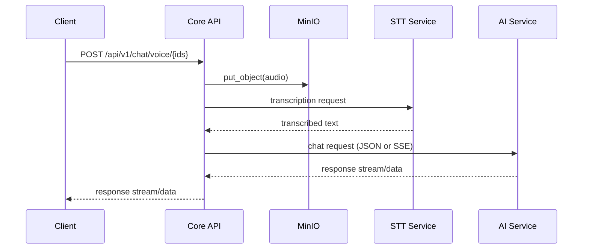

# Core API Service

## 1. Basics

- Service Name: core-api
- Primary Port: 8000 (Uvicorn inside the container)
- Docker Network Port: ${API_PORT}:8000 (host:container from docker-compose)
- Role in ecosystem: gateway service for auth, users, children, and chat orchestration. It delegates STT and AI calls and manages audio storage through MinIO.

## 2. Quick Start

### With pip (local)

1. cd services/api/app
2. pip install -r ../requirements.txt
3. Copy .env.example to .env and fill required secrets.
4. uvicorn main:app --host 0.0.0.0 --port 8000 --reload

### With docker compose

1. Make sure root .env and services/api/app/.env exist.
2. Start dependencies and API:

   docker compose up -d --build database cache file-storage ai-service stt-service core-api

3. Optional (MinIO buckets):

   docker compose up -d bucket-provisioner

## 3. Service Dependencies & Topology

| Dependency | Purpose | Connection Method | Endpoint / Port |
|---|---|---|---|
| STT Service | Speech-to-text for voice chat | HTTP | POST http://stt-service:8000/v1/stt/transcriptions |
| AI Service | Text generation and chat logic | HTTP / SSE | POST http://ai-service:8000/v1/ai/chat/... and /v1/ai/chat/stream/... |
| MinIO (file-storage) | Audio object storage and presigned URL serving | S3 API (minio client) | http://file-storage:9000 |
| Redis (cache) | Rate limit backend and cache | Redis protocol | redis://cache:6379 |
| PostgreSQL (database) | User, auth, and child profile persistence | SQLAlchemy + psycopg2 | database:5432 |

### Service Map

## 4. API Documentation (The FastAPI Edge)

- Swagger UI: /docs
- ReDoc: /redoc
- OpenAPI JSON: /openapi.json

### API endpoints

| Group | Method | Endpoint |
|---|---|---|
| Health | GET | / |
| Health | GET | /metrics |
| Auth | POST | /api/v1/auth/register |
| Auth | POST | /api/v1/auth/login |
| Auth | POST | /api/v1/auth/refresh |
| Auth | POST | /api/v1/auth/logout |
| Users | GET | /api/v1/users/me |
| Users | GET | /api/v1/users/me/summary |
| Users | GET | /api/v1/users/ |
| Users | GET | /api/v1/users/{user_id} |
| Children | POST | /api/v1/children |
| Children | GET | /api/v1/children |
| Children | PATCH | /api/v1/children/{child_id} |
| Chat | POST | /api/v1/chat/voice/{user_id}/{child_id}/{session_id} |
| Chat | POST | /api/v1/chat/text/{user_id}/{child_id}/{session_id} |
| Chat | GET | /api/v1/chat/history/{user_id}/{child_id}/{session_id} |
| Chat | DELETE | /api/v1/chat/history/{user_id}/{child_id}/{session_id} |

## 5. Environment & Configuration

Use services/api/app/.env.example as the full template.

| Variable | Required | Notes |
|---|---|---|
| CORS_ORIGINS | Yes | Must be a JSON-style list string, for example ["http://localhost:3000"]. |
| DB_PASSWORD | Yes | Required for DB connection. |
| SECRET_ACCESS_KEY | Yes | JWT access-token signing key. |
| SECRET_REFRESH_KEY | Yes | JWT refresh-token signing key. |
| DUMMY_HASH | Yes | Used in auth flows to reduce timing leak patterns when credentials are invalid. |
| CACHE_PASSWORD | Yes | Redis password used by limiter/cache. |
| STORAGE_ROOT_PASSWORD | Yes | MinIO secret key for audio operations. |
| SERVICE_TOKEN | No | Added as X-Service-Token in upstream service calls. |
| IS_PROD | No | Changes defaults (for example stricter rate limit and secure cookie behavior). |
| RATE_LIMIT | No | Slowapi format, for example 100/minute or 5/minute. |
| ACCESS_TOKEN_EXPIRE_SECONDS | No | Access token TTL in seconds. |
| REFRESH_TOKEN_EXPIRE_SECONDS | No | Refresh token TTL in seconds. |
| CSRF_TOKEN_EXPIRE_SECONDS | No | CSRF token TTL in seconds. |
| COOKIE_DOMAIN | No | Set in production if cookies must be shared across subdomains. |
| STT_SERVICE_ENDPOINT | No | STT service base URL. |
| AI_SERVICE_ENDPOINT | No | AI service base URL. |
| STORAGE_SERVICE_ENDPOINT | No | MinIO endpoint URL. |

## 6. Observability & Health Checks

- Health Check Endpoint: GET /
- Metrics: GET /metrics
- Logging:
  - App emits JSON logs with request tracing (X-Request-ID).
  - In Docker Compose, containers with label logging=promtail are scraped by Promtail.
  - Promtail forwards to Loki, and logs are queried in Grafana.
