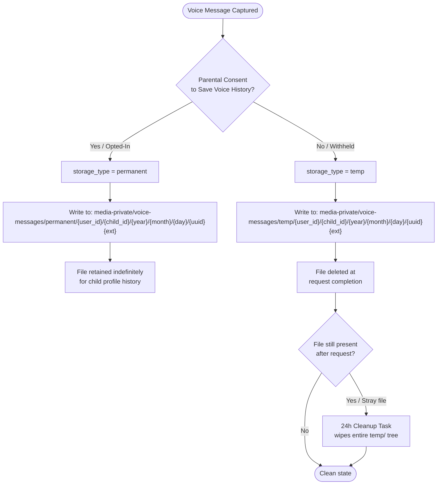

# Storage & Bucket Management Service

Manages the full lifecycle of media assets and sensitive voice data across the KidsMind ecosystem. This service operates under a **privacy-by-design** model, ensuring that child voice data is handled in strict accordance with parental consent.

---

## Table of Contents

- [Storage \& Bucket Management Service](#storage--bucket-management-service)
  - [Table of Contents](#table-of-contents)
  - [Architecture Overview](#architecture-overview)
  - [Auto-Initialization \& Bucket Provisioning](#auto-initialization--bucket-provisioning)
    - [Provisioner Behavior (`provision.sh`)](#provisioner-behavior-provisionsh)
    - [Bucket Reference](#bucket-reference)
  - [| `loki-chunks`   | Authenticated only         | Dedicated bucket for Loki log chunks (separate from app media) |](#-loki-chunks----authenticated-only----------dedicated-bucket-for-loki-log-chunks-separate-from-app-media-)
  - [Privacy-First Voice Storage Logic](#privacy-first-voice-storage-logic)
    - [Decision Flow](#decision-flow)
    - [Storage Path Behavior](#storage-path-behavior)
  - [File Naming Convention](#file-naming-convention)
    - [Pattern](#pattern)
    - [Parameter Reference](#parameter-reference)
    - [Example Paths](#example-paths)
  - [Cleanup Logic](#cleanup-logic)
    - [Immediate Deletion (Request-Scoped)](#immediate-deletion-request-scoped)
    - [24-Hour Fail-Safe Wipe](#24-hour-fail-safe-wipe)
  - [Repository Structure](#repository-structure)
  - [Data Governance \& Security](#data-governance--security)
    - [Privacy by Design](#privacy-by-design)
    - [Bucket Access Policies](#bucket-access-policies)
    - [Credential Management](#credential-management)

---

## Architecture Overview

The storage layer is split into two logical tiers, each with distinct access policies. All object storage—regardless of environment—exposes an S3-compatible API, which allows application code to remain fully environment-agnostic.

```
┌─────────────────────────────────────────────────────────────┐
│                      KidsMind Platform                      │
│                                                             │
│  ┌─────────────┐        ┌──────────────────────────────┐    │
│  │  AI Service │───────▶│       Storage Gateway       │    │  
│  │  STT Service│        │   (S3-Compatible API :9000)  │    │
│  │  API Service│        └──────────────┬───────────────┘    │
│  └─────────────┘                       │                    │
│                            ┌───────────┴───────────┐        │
│                            │                       │        │
│                   ┌────────▼──────┐    ┌───────────▼────┐   │
│                   │  media-public │    │ media-private  │   │
│                   │  (anonymous   │    │ (authenticated │   │
│                   │   read/write) │    │  access only)  │   │
│                   └───────────────┘    └────────────────┘   │
└─────────────────────────────────────────────────────────────┘
```

## Auto-Initialization & Bucket Provisioning

On every startup, the `bucket-service` sidecar (powered by `minio/mc`) runs `provision.sh` against the live storage endpoint. It creates the two essential buckets if they do not already exist, then applies access policies.

### Provisioner Behavior (`provision.sh`)

```sh
# Registers the storage alias
mc alias set myminio $STORAGE_SERVICE_ENDPOINT $MINIO_ROOT_USER $MINIO_ROOT_PASSWORD

# Creates buckets idempotently (safe to re-run)
mc mb myminio/media-public  --ignore-existing
mc mb myminio/media-private --ignore-existing
mc mb myminio/loki-chunks --ignore-existing

```

> The `bucket-service` uses `depends_on: service_healthy`, so provisioning only begins after the storage backend passes its readiness probe.

### Bucket Reference

| Bucket          | Access Policy      | Purpose                                                        |
|-----------------|--------------------|----------------------------------------------------------------|
| `media-public`  | Authenticated only | General application assets (avatars, badges, audio content)    |
| `media-private` | Authenticated only | Sensitive user data, child voice recordings, AI interactions   |
| `loki-chunks`   | Authenticated only | Dedicated bucket for Loki log chunks (separate from app media) |
---

## Public Media Key Convention

All metadata-backed assets stored in `media-public` follow this schema:

```
{category}/{sub_category}/{uuid_or_slug}.{ext}
```

Examples:

```
avatars/starter/avatar_001.webp
avatars/rare/avatar_012.webp
badges/achievement/first_lesson.webp
audio/tracks/happy_theme.mp3
audio/effects/correct_answer.mp3
```

## Privacy-First Voice Storage Logic

All voice data captured during AI chat sessions is stored inside `media-private/voice-messages/`. The storage path and retention behavior are determined exclusively by **parental consent status** at the time of the request.

### Decision Flow



### Storage Path Behavior

| Consent Status       | `storage_type` | Retention Policy                                          |
|----------------------|----------------|-----------------------------------------------------------|
| Parent opted-in      | `permanent`    | Retained indefinitely as part of the child's voice history|
| Consent withheld     | `temp`         | Deleted immediately after the originating request ends    |
| Stray / leaked file  | `temp`         | Purged by the 24-hour scheduled cleanup task              |

---

## File Naming Convention

All voice objects stored under `media-private/voice-messages/` follow a strict hierarchical naming schema. This schema guarantees full data traceability, eliminates naming collisions, and enables efficient prefix-based queries (e.g., all files for a given child in a given month).

### Pattern

```
voice-messages/{storage_type}/{user_id}/{child_id}/{year}/{month}/{day}/{unique_id}{extension}
```

### Parameter Reference

| Segment          | Type     | Values / Format                  | Description                                                                 |
|------------------|----------|----------------------------------|-----------------------------------------------------------------------------|
| `storage_type`   | `string` | `permanent` \| `temp`           | Consent-driven storage tier. Always one of these two literals.              |
| `user_id`        | `string` | UUID v4                          | The authenticated parent/guardian account identifier.                       |
| `child_id`       | `string` | UUID v4                          | The child profile identifier within the parent's account.                   |
| `year`           | `string` | `YYYY` (e.g., `2025`)            | UTC year of recording, used for time-based partitioning.                    |
| `month`          | `string` | `MM` (e.g., `03`)                | UTC month, zero-padded.                                                     |
| `day`            | `string` | `DD` (e.g., `04`)                | UTC day, zero-padded.                                                       |
| `unique_id`      | `string` | UUID v4                  | Collision-resistant unique identifier generated at upload time.             |
| `extension`      | `string` | `.webm`, `.ogg`, `.wav`, `.mp3`  | Audio format extension derived from the originating capture format.         |

### Example Paths

```
# Parent has opted-in — voice is retained permanently
voice-messages/permanent/a1b2c3d4-.../f9e8d7c6-.../2025/03/04/0193fade-....mp3

# No parental consent — file is staged for immediate deletion
voice-messages/temp/a1b2c3d4-.../f9e8d7c6-.../2025/03/04/0193fade-....mp3
```

---

## Cleanup Logic

### Immediate Deletion (Request-Scoped)

When a voice request completes and `storage_type = temp`, the service deletes the object from `media-private/voice-messages/temp/` before returning the response to the client. This is a synchronous, in-process deletion — no scheduler required.

### 24-Hour Fail-Safe Wipe

A scheduled background task runs **every 24 hours** and recursively deletes all objects under the `temp/` prefix:

```
media-private/voice-messages/temp/**
```

**Trigger conditions for stray files:**

- Network interruption after upload but before the cleanup callback executed.
- Application crash or unhandled exception during post-request teardown.
- Partial request lifecycle leaving an orphaned object.

**Guarantees:**

- No sensitive child voice data can accumulate in the `temp/` directory beyond a 24-hour window.
- The cleanup task is idempotent — running it against an already-empty prefix is a no-op.
- The task operates at the storage layer (S3/MinIO prefix delete), not at the application layer, ensuring it runs even if the AI or STT service itself is degraded.

> **Compliance note:** This dual-layer deletion strategy (immediate + scheduled) is intentional. The 24-hour window is an upper bound, not a target — the primary mechanism is always immediate request-scoped deletion.

---

## Repository Structure

```
infra/
└── storage/
    ├── provision.sh      # Bucket provisioner script (runs inside bucket-provisioner container)
    └── README.md         # This document
```

The `provision.sh` script is bind-mounted into the `bucket-provisioner` container at runtime:

```yaml
# docker-compose.yml
volumes:
  - ./infra/storage/provision.sh:/provision.sh
```

---

## Data Governance & Security

### Privacy by Design

The storage service was architected around GDPR and COPPA principles from the ground up, given that it handles biometric-adjacent data (child voice recordings).

| Principle                 | Implementation                                                                        |
|---------------------------|---------------------------------------------------------------------------------------|
| **Data Minimization**     | Temp files are deleted at request boundary; no long-term retention without consent.   |
| **Purpose Limitation**    | `media-private` is access-controlled; no anonymous read policy is applied.            |
| **Consent Enforcement**   | Storage tier (`permanent` vs `temp`) is derived from a runtime consent flag, not config. |
| **Fail-Safe Defaults**    | If consent state is ambiguous, the system defaults to `temp` (destructive path).      |
| **Auditability**          | The hierarchical path schema encodes `user_id` and `child_id` for traceability.       |
| **Separation of Concerns**| Public and private assets live in entirely separate buckets with different policies.   |

### Bucket Access Policies

| Bucket          | Anonymous Read | Authenticated Read | Authenticated Write |
|-----------------|:--------------:|:------------------:|:-------------------:|
| `media-public`  | No            | Yes                | Yes                 |
| `media-private` | No             | Yes                | Yes                 |
| `loki-chunks`   | No             | Yes                | Yes                 |

### Credential Management

- Development credentials are injected via environment variables (`MINIO_ROOT_USER`, `MINIO_ROOT_PASSWORD`) sourced from `.env`.
