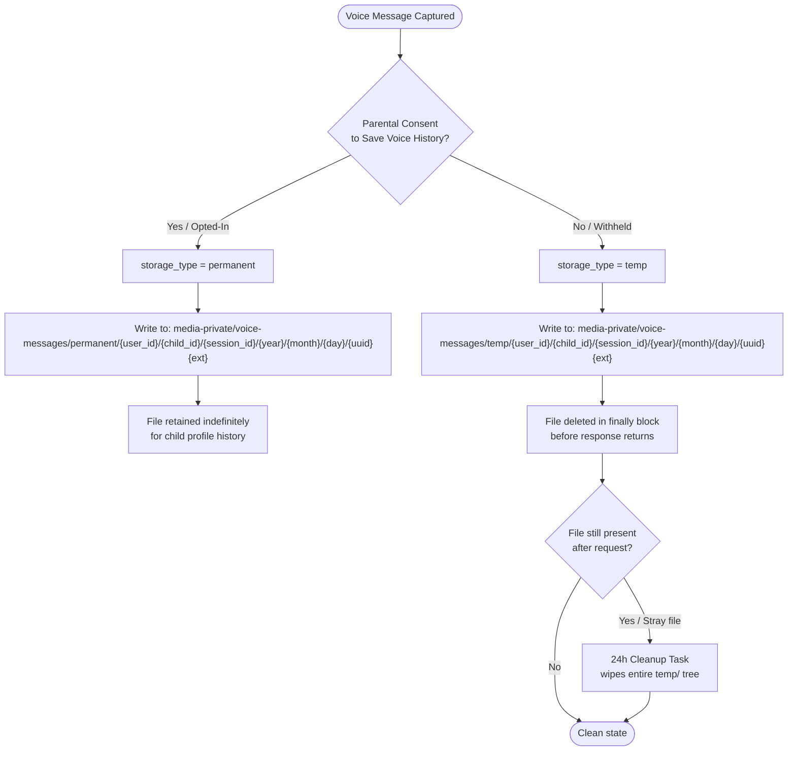

# Storage & Bucket Management Service


Manages the full lifecycle of media assets and sensitive voice data across the KidsMind ecosystem. This service operates under a **privacy-by-design** model, ensuring that child voice data is handled in strict accordance with parental consent.

---

## Table of Contents

- [Architecture Overview](#architecture-overview)
- [Auto-Initialization & Bucket Provisioning](#auto-initialization--bucket-provisioning)
  - [Provisioner Behavior (`provision.sh`)](#provisioner-behavior-provisionsh)
  - [Bucket Reference](#bucket-reference)
- [Public Media Key Convention](#public-media-key-convention)
- [Privacy-First Voice Storage Logic](#privacy-first-voice-storage-logic)
  - [Decision Flow](#decision-flow)
  - [Storage Path Behavior](#storage-path-behavior)
- [File Naming Convention](#file-naming-convention)
  - [Pattern](#pattern)
  - [Parameter Reference](#parameter-reference)
  - [Example Paths](#example-paths)
- [Cleanup Logic](#cleanup-logic)
  - [Immediate Deletion (Request-Scoped)](#immediate-deletion-request-scoped)
  - [24-Hour Fail-Safe Wipe](#24-hour-fail-safe-wipe)
- [Repository Structure](#repository-structure)
- [Data Governance & Security](#data-governance--security)
  - [Privacy by Design](#privacy-by-design)
  - [Bucket Access Policies](#bucket-access-policies)
  - [Credential Management](#credential-management)

---

## Architecture Overview

The storage layer is split into two logical tiers, each with distinct access policies. All object storage—regardless of environment—exposes an S3-compatible API, which allows application code to remain fully environment-agnostic.

```
┌──────────────────────────────────────────────────────────────────┐
│ KidsMind Platform                                                │
│                                                                  │
│  ┌─────────────┐    ┌─────────────┐   ┌────────────────────────┐ │
│  │ API Service │    │ STT Service │   │ Loki / Chat Archiver   │ │
│  │ (minio SDK) │    │ (via URL)   │   │ (minio SDK / mc)       │ │
│  └──────┬──────┘    └──────┬──────┘   └───────────┬────────────┘ │
│         │                  │                      │              │
│         └──────────────────┼──────────────────────┘              │
│                            ▼                                     │
│         ┌──────────────────────────────────────┐                 │
│         │  MinIO (S3-Compatible API :9000)     │                 │
│         │  Console UI :9001                    │                 │
│         └────────────────┬─────────────────────┘                 │
│                          │                                       │
│    ┌────────────────┬────┴──────────┬──────────────────┐         │
│    ▼                ▼               ▼                  ▼         │
│ ┌────────────┐ ┌──────────────┐ ┌──────────────┐ ┌────────────┐  │
│ │media-public│ │media-private │ │ loki-chunks  │ │chat-archive│  │
│ │(auth only) │ │ (auth only)  │ │ (auth only)  │ │(auth only) │  │
│ └────────────┘ └──────────────┘ └──────────────┘ └────────────┘  │
└──────────────────────────────────────────────────────────────────┘
```

### Service Dependencies

| Service | Image | Role |
|---|---|---|
| `file-storage` | `minio/minio:RELEASE.2025-09-07T16-13-09Z-cpuv1` | S3-compatible object store |
| `bucket-provisioner` | `minio/mc:RELEASE.2025-08-13T08-35-41Z-cpuv1` | Idempotent bucket creation sidecar |

`core-api` depends on both services:

```yaml
depends_on:
  file-storage:
    condition: service_healthy
  bucket-provisioner:
    condition: service_completed_successfully
```

This means the API **will not start** until MinIO is healthy **and** the provisioner has exited successfully.

### Port Availability

| Port | Service | Exposed By Default? | Purpose |
|------|---------|:-------------------:|---------|
| `:9000` | MinIO S3 API | No (internal only) | Object storage endpoint |
| `:9001` | MinIO Console | No (internal only) | Web management UI |

Ports are only published to `127.0.0.1` when `docker-compose.debug.yml` is loaded (see [Env Setup](#credential-management)).

---

## Auto-Initialization & Bucket Provisioning

On every startup, the `bucket-provisioner` sidecar (powered by `minio/mc`) runs `provision.sh` against the live storage endpoint. It creates all required buckets if they do not already exist, then exits with code 0. The container has `restart: "no"` — it runs once and stops.

> **Windows note:** The container entrypoint strips CRLF line endings before executing the script:
>
> ```yaml
> entrypoint: ["/bin/sh", "-c", "tr -d '\\r' < /provision.sh > /tmp/provision.sh && /bin/sh /tmp/provision.sh"]
> ```

### Provisioner Behavior (`provision.sh`)

```sh
#!/bin/sh
set -eu

ALIAS="myminio"
ENDPOINT="$STORAGE_SERVICE_ENDPOINT"

echo "Connecting to MinIO at $ENDPOINT with alias '$ALIAS'..."

mc alias set "$ALIAS" "$ENDPOINT" "$MINIO_ROOT_USER" "$MINIO_ROOT_PASSWORD"

mc mb "$ALIAS/media-public" --ignore-existing
mc mb "$ALIAS/media-private" --ignore-existing
mc mb "$ALIAS/loki-chunks" --ignore-existing
mc mb "$ALIAS/chat-archive" --ignore-existing

echo "Setup complete. Buckets are ready."
```

> The `bucket-provisioner` uses `depends_on: file-storage: condition: service_healthy`, so provisioning only begins after MinIO passes its readiness probe (`curl -f http://127.0.0.1:9000/minio/health/ready` — 5s interval, 5s timeout, 5 retries).

### Bucket Reference

| Bucket | Access Policy | Purpose |
|---|---|---|
| `media-public` | Authenticated only | General application assets (avatars, badges, audio content) |
| `media-private` | Authenticated only | Sensitive user data, child voice recordings, AI interactions |
| `loki-chunks` | Authenticated only | Dedicated bucket for Loki log chunks (separate from app media) |
| `chat-archive` | Authenticated only | Archived chat session histories stored as NDJSON |

---

## Public Media Key Convention

All metadata-backed assets stored in `media-public` follow this schema:

```
{category}/{sub_category}/{uuid_or_slug}.{ext}
```

Examples:

```
avatars/starter/avatar_001.webp
avatars/rare/avatar_012.webp
badges/achievement/first_lesson.webp
audio/tracks/happy_theme.mp3
audio/effects/correct_answer.mp3
```

---

## Privacy-First Voice Storage Logic

All voice data captured during AI chat sessions is stored inside `media-private/voice-messages/`. The storage path and retention behavior are determined exclusively by **parental consent status** at the time of the request.

### Decision Flow



### Storage Path Behavior

| Consent Status | `storage_type` | Retention Policy |
|---|---|---|
| Parent opted-in | `permanent` | Retained indefinitely as part of the child's voice history |
| Consent withheld | `temp` | Deleted in `finally` block before the response returns to the client |
| Stray / leaked file | `temp` | Purged by the 24-hour scheduled cleanup task |

---

## File Naming Convention

All voice objects stored under `media-private/voice-messages/` follow a strict hierarchical naming schema. This schema guarantees full data traceability, eliminates naming collisions, and enables efficient prefix-based queries (e.g., all files for a given child in a given month).

### Pattern

```
voice-messages/{storage_type}/{user_id}/{child_id}/{session_id}/{year}/{month}/{day}/{unique_id}{extension}
```

> **Note:** The `session_id` segment scopes files to the originating chat session, enabling per-session cleanup and audit queries.

### Parameter Reference

| Segment | Type | Values / Format | Description |
|---|---|---|---|
| `storage_type` | `string` | `permanent` \| `temp` | Consent-driven storage tier. Always one of these two literals. |
| `user_id` | `string` | UUID v4 | The authenticated parent/guardian account identifier. |
| `child_id` | `string` | UUID v4 | The child profile identifier within the parent's account. |
| `session_id` | `string` | UUID v4 | The chat session identifier. Groups all voice messages from a single conversation. |
| `year` | `string` | `YYYY` (e.g., `2025`) | UTC year of recording, used for time-based partitioning. |
| `month` | `string` | `MM` (e.g., `03`) | UTC month, zero-padded. |
| `day` | `string` | `DD` (e.g., `04`) | UTC day, zero-padded. |
| `unique_id` | `string` | UUID v4 | Collision-resistant unique identifier generated at upload time. |
| `extension` | `string` | `.webm`, `.ogg`, `.wav`, `.mp3` | Audio format extension derived from the originating capture format. |

### Example Paths

```
# Parent has opted-in — voice is retained permanently
voice-messages/permanent/a1b2c3d4-.../f9e8d7c6-.../sess-uuid-.../2025/03/04/0193fade-....mp3

# No parental consent — file is staged for immediate deletion
voice-messages/temp/a1b2c3d4-.../f9e8d7c6-.../sess-uuid-.../2025/03/04/0193fade-....mp3
```

---

## Cleanup Logic

### Immediate Deletion (Request-Scoped)

When a voice request completes and `store_audio = False` (consent withheld), the `voice_chat_controller` deletes the object from `media-private` inside a `try/finally` block **before** returning the response to the client.
This is a synchronous, in-process deletion — no scheduler required. The `remove_audio` function calls `minio_client.remove_object("media-private", filename)` directly.

> **Operational note:** If the MinIO connection drops during the `finally` block, the deletion will raise and the file becomes a stray. This is exactly the scenario the 24-hour fail-safe wipe covers.

### 24-Hour Fail-Safe Wipe

A scheduled background task is intended to run **every 24 hours** and recursively delete all objects under the `temp/` prefix:

```
media-private/voice-messages/temp/**
```

> **Implementation status:** The 24-hour scheduled cleanup task is **not yet implemented** in the current codebase. Only the immediate request-scoped deletion in the `finally` block is active. Stray files from crash or network-failure scenarios will remain in `temp/` until this task is deployed.

**Trigger conditions for stray files:**

- Network interruption after upload but before the `finally` callback executed.
- Application crash or unhandled exception during post-request teardown.
- Partial request lifecycle leaving an orphaned object.

**Designed guarantees (once implemented):**

- No sensitive child voice data can accumulate in the `temp/` directory beyond a 24-hour window.
- The cleanup task is idempotent — running it against an already-empty prefix is a no-op.
- The task operates at the storage layer (S3/MinIO prefix delete), not at the application layer, ensuring it runs even if the AI or voice service itself is degraded.

> **Compliance note:** This dual-layer deletion strategy (immediate + scheduled) is intentional. The 24-hour window is an upper bound, not a target — the primary mechanism is always immediate request-scoped deletion.

---

## Repository Structure

```
infra/
└── storage/
    ├── provision.sh   # Bucket provisioner script (runs inside bucket-provisioner container)
    └── README.md      # This document
```

The `provision.sh` script is bind-mounted read-only into the `bucket-provisioner` container at runtime:

```yaml
# docker-compose.yml
volumes:
  - ./infra/storage/provision.sh:/provision.sh:ro
```

---

## Data Governance & Security

### Privacy by Design

The storage service was architected around GDPR and COPPA principles from the ground up, given that it handles biometric-adjacent data (child voice recordings).

| Principle | Implementation |
|---|---|
| **Data Minimization** | Temp files are deleted at request boundary; no long-term retention without consent. |
| **Purpose Limitation** | `media-private` is access-controlled; no anonymous read policy is applied. |
| **Consent Enforcement** | Storage tier (`permanent` vs `temp`) is derived from a runtime consent flag, not config. |
| **Fail-Safe Defaults** | If consent state is ambiguous, the system defaults to `temp` (destructive path). |
| **Auditability** | The hierarchical path schema encodes `user_id` and `child_id` for traceability. |
| **Separation of Concerns** | Public and private assets live in entirely separate buckets with different policies. |

### Bucket Access Policies

| Bucket | Anonymous Read | Authenticated Read | Authenticated Write |
|---|:---:|:---:|:---:|
| `media-public` | No | Yes | Yes |
| `media-private` | No | Yes | Yes |
| `loki-chunks` | No | Yes | Yes |
| `chat-archive` | No | Yes | Yes |

### Credential Management

| Variable | Where Set | Default | Required | Description |
|---|---|---|:---:|---|
| `STORAGE_ROOT_USER` | Root `.env` | `admin` (in `config.py`) | Yes | MinIO root username. Validated non-empty at API startup. |
| `STORAGE_ROOT_PASSWORD` | Root `.env` | — | Yes | MinIO root password. App crashes if missing or empty. |
| `STORAGE_SERVICE_ENDPOINT` | Root `.env` | `http://file-storage:9000` | Yes | Internal Docker DNS endpoint for MinIO. |
| `MINIO_PROMETHEUS_AUTH_TYPE` | `docker-compose.yml` | `public` | No | Allows unauthenticated Prometheus metric scraping. |
| `STORAGE_API_PORT` | Root `.env` | `9000` | No | Localhost port for MinIO API (debug mode only). |
| `STORAGE_CONSOLE_PORT` | Root `.env` | `9001` | No | Localhost port for MinIO Console UI (debug mode only). |

**Setup:**

1. Copy the root `.env.example` to `.env` and fill in `STORAGE_ROOT_USER` / `STORAGE_ROOT_PASSWORD`:

   ```sh
   cp .env.example .env
   ```

2. For debug access to the MinIO Console UI, append `docker-compose.debug.yml` to `COMPOSE_FILE` in your root `.env`:

   ```ini
   COMPOSE_FILE=docker-compose.yml;docker-compose.override.yml;docker-compose.debug.yml
   ```

3. Start the stack:

   ```sh
   docker compose up --build
   ```

4. Access the MinIO Console at `http://127.0.0.1:9001` (debug mode only). Log in with the credentials from your `.env`.

**Application-level storage settings (in `services/api/app/core/config.py`):**

| Setting | Default | Description |
|---|---|---|
| `MEDIA_SIGNED_URL_TTL_SECONDS` | `86400` (24h) | TTL for presigned download URLs. |
| `AVATAR_URL_CACHE_TTL_SECONDS` | `82800` (23h) | How long avatar signed URLs are cached. |
| `AVATAR_URL_CACHE_REFRESH_BUFFER_SECONDS` | `3600` (1h) | Refresh avatar URL this long before expiry. |

> The MinIO Python client (`core/storage.py`) connects with `secure=False` (plain HTTP). TLS termination, if needed, must happen at a reverse proxy or ingress layer outside the container network.

**Re-provisioning buckets (e.g., after a wipe):**

```sh
docker compose up --force-recreate --no-deps bucket-provisioner
```

This re-runs `provision.sh` against the live MinIO instance without restarting the storage server itself.
